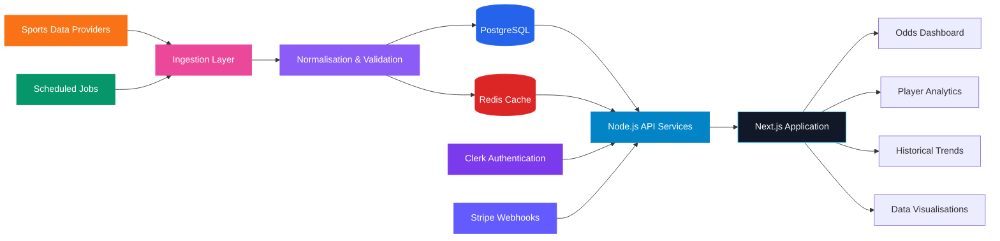

<!--
  GitHub Profile README — Alok Tomar
  Senior engineering profile with restrained animation and a multicolour visual system.
-->

<div align="center">

<picture>
  <source
    media="(prefers-color-scheme: dark)"
    srcset="https://capsule-render.vercel.app/api?type=waving&height=285&color=0:7C3AED,42:0EA5E9,72:06B6D4,100:EC4899&text=ALOK%20TOMAR&fontColor=FFFFFF&fontSize=54&fontAlignY=35&desc=Senior%20Full%20Stack%20Software%20Engineer&descSize=19&descAlignY=54&animation=fadeIn"
  />
  <source
    media="(prefers-color-scheme: light)"
    srcset="https://capsule-render.vercel.app/api?type=waving&height=285&color=0:8B5CF6,42:38BDF8,72:22D3EE,100:F472B6&text=ALOK%20TOMAR&fontColor=FFFFFF&fontSize=54&fontAlignY=35&desc=Senior%20Full%20Stack%20Software%20Engineer&descSize=19&descAlignY=54&animation=fadeIn"
  />
  
</picture>


<br />

<a href="https://statyx.io">
  
</a>
<a href="https://www.linkedin.com/in/alok-tomar-9741321b4/">
  
</a>
<a href="mailto:aloktomar055@gmail.com">
  
</a>
<a href="https://github.com/aloktomarr">
  
</a>

<br />
<br />


</div>

---

<div align="center">


</div>

## `whoami`

I am a **Full Stack Software Engineer with 4+ years of experience** building enterprise applications, scalable SaaS platforms, backend services, analytics dashboards and data-intensive web products.

My work sits at the intersection of:

```text
Product Engineering × Frontend Architecture × Backend Systems × Data
```

My primary stack includes **React, Next.js, Node.js, TypeScript, PostgreSQL and Redis**, supported by experience in authentication, payments, caching, third-party integrations, background processing, data visualisation and performance engineering.

I am also the **Founder and Lead Engineer of Statyx**, a production sports analytics platform built for real-time odds, player analytics, historical trends and subscription-based research tools.

> I build interfaces users can understand and systems engineers can maintain.

---

## Engineering Snapshot

<table>
<tr>
<td width="33%" valign="top">

### 🎨 Frontend Systems

* React and Next.js architecture
* TypeScript-first engineering
* Reusable component systems
* Data-heavy analytics interfaces
* Responsive and accessible UI
* Redux Toolkit and RTK Query
* Rendering and bundle optimisation
* D3.js, Recharts and Chart.js

</td>
<td width="33%" valign="top">

### ⚙️ Backend & Data

* Node.js and REST APIs
* PostgreSQL data modelling
* Redis caching strategies
* Authentication and RBAC
* Webhooks and scheduled jobs
* Third-party API integrations
* Query and index optimisation
* Background data processing

</td>
<td width="33%" valign="top">

### 🚀 Product Engineering

* SaaS application architecture
* Subscription systems
* Stripe payment workflows
* Clerk authentication
* Monorepo architecture
* Performance engineering
* Production debugging
* End-to-end product ownership

</td>
</tr>
</table>

---

## Technology Stack

<div align="center">

### Core Engineering


<br />
<br />

### Application Development


<br />
<br />

### Infrastructure & Tooling


<br />
<br />


</div>

---

<div align="center">


<br />

<a href="https://statyx.io">
  
</a>
<a href="https://github.com/aloktomarr/oddsup">
  
</a>

</div>

<br />

## Statyx — Sports Analytics SaaS Platform

**Statyx** is a production analytics platform that helps users research sports odds, player props, line movement, historical performance and betting trends through interactive dashboards.

I designed and developed the product from concept to production, covering frontend architecture, backend integrations, authentication, subscriptions, third-party data providers, visualisation systems and deployment.

<table>
<tr>
<td align="center" width="25%">

### `200+`

Registered users

</td>
<td align="center" width="25%">

### `100+`

Active daily users

</td>
<td align="center" width="25%">

### `REAL-TIME`

Odds and analytics

</td>
<td align="center" width="25%">

### `MULTI-SPORT`

Analytics platform

</td>
</tr>
</table>

### Product Capabilities

* Real-time odds aggregation
* Player props and performance analytics
* Historical trend analysis
* Line movement tracking
* Betting research dashboards
* Interactive statistical visualisations
* Multi-sports data support
* Secure authentication and protected access
* Subscription-based SaaS architecture
* Responsive desktop and mobile experience

---

## Statyx System Architecture



### Engineering Decisions

| Area           | Implementation                                               |
| -------------- | ------------------------------------------------------------ |
| Application    | React, Next.js and TypeScript                                |
| Backend        | Node.js services and REST APIs                               |
| Database       | PostgreSQL for structured analytical data                    |
| Caching        | Redis for frequently requested data                          |
| Authentication | Clerk with protected application routes                      |
| Payments       | Stripe subscriptions and webhook synchronisation             |
| Visualisation  | D3.js, Recharts and Chart.js                                 |
| Data ingestion | Scheduled synchronisation and provider abstraction           |
| Performance    | Caching, memoisation, code splitting and selective rendering |

### Engineering Challenges Solved

* Normalised inconsistent responses across multiple sports data providers
* Designed caching strategies balancing speed and data freshness
* Optimised analytical queries for read-heavy dashboard workloads
* Built reusable chart and visualisation components
* Implemented reliable subscription synchronisation through Stripe webhooks
* Reduced redundant requests using client-side and server-side caching
* Created responsive layouts for dense statistical datasets
* Designed the architecture to support additional sports and analytics modules

---

<div align="center">


</div>

<table>
<tr>
<td width="50%" valign="top">

### 🎨 SketchSkribble

Browser-based drawing application with configurable brushes, colour controls and image export.

**Engineering focus:** Canvas APIs, interactive interfaces and client-side state.

<br />

<a href="https://github.com/aloktomarr/SketchSkribble">
  
</a>

</td>
<td width="50%" valign="top">

### 🤖 Opensource_AI

Chrome extension providing AI-assisted insights for GitHub issues and open-source contribution workflows.

**Engineering focus:** Browser extensions, API integrations and developer tooling.

<br />

<a href="https://github.com/aloktomarr/Opensource_AI">
  
</a>

</td>
</tr>

<tr>
<td width="50%" valign="top">

### 🎬 Video Streaming Application

React streaming interface using Redux, Firebase, TMDB APIs, Tailwind CSS and Jest.

**Engineering focus:** State management, API integration and reusable UI architecture.

<br />

<a href="https://github.com/aloktomarr/VideoStreamingApp">
  
</a>

</td>
<td width="50%" valign="top">

### 🔗 URL Shortener

Node.js service for generating and resolving compact URLs through a clean backend API.

**Engineering focus:** API design, routing and backend fundamentals.

<br />

<a href="https://github.com/aloktomarr/urlshortner">
  
</a>

</td>
</tr>
</table>

---

<div align="center">


<br />

<picture>
  <source
    media="(prefers-color-scheme: dark)"
    srcset="https://github-profile-summary-cards.vercel.app/api/cards/profile-details?username=aloktomarr&theme=tokyonight"
  />
  <source
    media="(prefers-color-scheme: light)"
    srcset="https://github-profile-summary-cards.vercel.app/api/cards/profile-details?username=aloktomarr&theme=vue"
  />
  
</picture>

<br />


<br />
<br />


<br />
<br />

<picture>
  <source
    media="(prefers-color-scheme: dark)"
    srcset="https://github-readme-activity-graph.vercel.app/graph?username=aloktomarr&bg_color=0D1117&color=A78BFA&line=22D3EE&point=EC4899&area_color=7C3AED&area=true&hide_border=true&custom_title=Contribution%20Activity"
  />
  <source
    media="(prefers-color-scheme: light)"
    srcset="https://github-readme-activity-graph.vercel.app/graph?username=aloktomarr&bg_color=FFFFFF&color=7C3AED&line=0284C7&point=EC4899&area_color=BAE6FD&area=true&hide_border=true&custom_title=Contribution%20Activity"
  />
  
</picture>

</div>

---

## Engineering Principles

```text
01. Design for change, not imaginary scale.
02. Keep interfaces simple and implementation details private.
03. Measure performance before optimising it.
04. Prefer readable systems over clever abstractions.
05. Make invalid states difficult to represent.
06. Treat observability as a feature, not an afterthought.
07. Cache carefully. Invalidate deliberately.
```

When all else fails:

```bash
git blame
```

Strictly for historical research.

---

## Currently Exploring

* Distributed systems and service boundaries
* Event-driven architecture
* Backend scalability and fault tolerance
* PostgreSQL query planning and indexing
* Real-time data ingestion pipelines
* Observability and production reliability
* Advanced data visualisation systems
* Better ways to explain that “works locally” is not a deployment strategy

---

## Open to Engineering Opportunities

I am interested in roles involving:

`Full Stack Engineering` · `Backend Engineering` · `Frontend Architecture`
`SaaS Platforms` · `Sports Technology` · `Analytics Products` · `Developer Tools`

Open to:

* Remote opportunities
* International relocation
* Visa-sponsored software engineering roles
* Product-focused engineering teams
* Technically ambitious early-stage companies

---

<div align="center">


<br />

<a href="mailto:aloktomar055@gmail.com">
  
</a>
<a href="https://www.linkedin.com/in/alok-tomar-9741321b4/">
  
</a>
<a href="https://statyx.io">
  
</a>

<br />
<br />

<sub>
Built with engineering, iteration and a professionally reasonable amount of caffeine.
</sub>

<br />
<br />

<picture>
  <source
    media="(prefers-color-scheme: dark)"
    srcset="https://raw.githubusercontent.com/aloktomarr/aloktomarr/output/github-contribution-grid-snake-dark.svg"
  />
  <source
    media="(prefers-color-scheme: light)"
    srcset="https://raw.githubusercontent.com/aloktomarr/aloktomarr/output/github-contribution-grid-snake.svg"
  />
  
</picture>

<picture>
  <source
    media="(prefers-color-scheme: dark)"
    srcset="https://capsule-render.vercel.app/api?type=waving&height=150&section=footer&color=0:EC4899,32:8B5CF6,68:0EA5E9,100:10B981"
  />
  <source
    media="(prefers-color-scheme: light)"
    srcset="https://capsule-render.vercel.app/api?type=waving&height=150&section=footer&color=0:F472B6,32:A78BFA,68:38BDF8,100:34D399"
  />
  
</picture>

</div>
