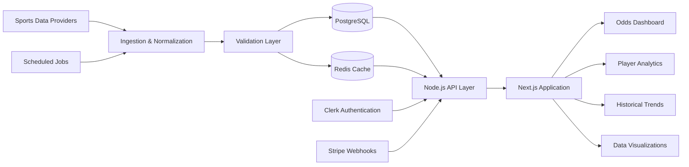

<!--
  GitHub Profile README — Alok Tomar
  Clean, product-focused and intentionally low on decorative noise.
-->

<div align="center">

<picture>
  <source
    media="(prefers-color-scheme: dark)"
    srcset="https://capsule-render.vercel.app/api?type=waving&height=260&color=0:020617,45:0f172a,100:1e3a5f&text=ALOK%20TOMAR&fontColor=f8fafc&fontSize=52&fontAlignY=36&desc=Senior%20Full%20Stack%20Engineer&descSize=19&descAlignY=54&animation=fadeIn"
  />
  <source
    media="(prefers-color-scheme: light)"
    srcset="https://capsule-render.vercel.app/api?type=waving&height=260&color=0:e2e8f0,45:cbd5e1,100:93c5fd&text=ALOK%20TOMAR&fontColor=0f172a&fontSize=52&fontAlignY=36&desc=Senior%20Full%20Stack%20Engineer&descSize=19&descAlignY=54&animation=fadeIn"
  />
  
</picture>


<br />

<a href="https://statyx.io">
  
</a>
<a href="https://www.linkedin.com/in/alok-tomar-9741321b4/">
  
</a>
<a href="mailto:aloktomar055@gmail.com">
  
</a>

<br />
<br />


</div>

---

## `whoami`

I am a **Full Stack Software Engineer with 4+ years of experience** building enterprise applications, scalable SaaS products, backend services, analytics dashboards and data-intensive web platforms.

My work sits at the intersection of:

```text
Product Engineering  ×  Frontend Architecture  ×  Backend Systems  ×  Data
```

I primarily work with **React, Next.js, Node.js, TypeScript, PostgreSQL and Redis**, with experience across authentication, payments, caching, API integrations, background processing, data visualization and performance engineering.

I am also the **Founder and Lead Engineer of Statyx** — a production sports analytics platform built from the ground up for real-time odds, player insights, historical trends and subscription-based analytics.

> I enjoy solving difficult engineering problems — preferably before they become production incidents.

---

## Engineering Snapshot

<table>
<tr>
<td width="33%" valign="top">

### Frontend Systems

* React and Next.js architecture
* TypeScript-first development
* Reusable component systems
* Data-heavy dashboards
* Responsive and accessible UI
* Rendering and bundle optimization
* Redux Toolkit and RTK Query
* D3.js, Recharts and Chart.js

</td>
<td width="33%" valign="top">

### Backend & Data

* Node.js and REST APIs
* PostgreSQL data modelling
* Redis caching strategies
* Authentication and RBAC
* Webhooks and cron jobs
* Third-party API integrations
* Query and index optimization
* Background data processing

</td>
<td width="33%" valign="top">

### Product Engineering

* SaaS architecture
* Subscription systems
* Stripe payment workflows
* Clerk authentication
* Monorepo architecture
* Performance optimization
* Production debugging
* End-to-end ownership

</td>
</tr>
</table>

---

## Technology Stack

<div align="center">

### Core Engineering


<br />
<br />

### Interface & Application Development


<br />
<br />

### Infrastructure & Tooling


<br />
<br />


</div>

---

# Featured Product

<div align="center">


<br />

<a href="https://statyx.io">
  
</a>
<a href="https://github.com/aloktomarr/oddsup">
  
</a>

</div>

<br />

## Statyx — Sports Analytics SaaS Platform

**Statyx** is a production analytics platform that helps users research sports odds, player props, line movement, historical performance and betting trends through interactive, data-rich dashboards.

I designed and developed the platform from concept to production, including its application architecture, frontend systems, backend integrations, authentication, subscription workflows, data visualizations and deployment strategy.

<table>
<tr>
<td align="center" width="25%">
<h3>200+</h3>
Registered users
</td>
<td align="center" width="25%">
<h3>100+</h3>
Active daily users
</td>
<td align="center" width="25%">
<h3>Real-time</h3>
Odds and analytics
</td>
<td align="center" width="25%">
<h3>Multi-sport</h3>
Data platform
</td>
</tr>
</table>

### Product Capabilities

* Real-time odds aggregation
* Player props and performance analytics
* Historical trend analysis
* Line movement tracking
* Betting research dashboards
* Interactive statistical visualizations
* Multi-sports data support
* Secure authentication and protected access
* Subscription-based SaaS architecture
* Responsive desktop and mobile experience

---

## Statyx System Architecture



### Engineering Decisions

| Area           | Implementation                                               |
| -------------- | ------------------------------------------------------------ |
| Application    | React, Next.js and TypeScript                                |
| Backend        | Node.js services and REST APIs                               |
| Database       | PostgreSQL for structured analytical data                    |
| Caching        | Redis for frequently requested data                          |
| Authentication | Clerk with protected application routes                      |
| Payments       | Stripe subscriptions and webhook synchronization             |
| Visualizations | D3.js, Recharts and Chart.js                                 |
| Data ingestion | Scheduled synchronization and provider abstraction           |
| Performance    | Caching, memoization, code splitting and selective rendering |

### Engineering Challenges Solved

* Normalized inconsistent data structures across multiple sports API providers
* Designed caching strategies that balance speed with data freshness
* Optimized analytical queries for read-heavy dashboard workloads
* Built reusable chart and visualization components
* Implemented reliable subscription synchronization using Stripe webhooks
* Reduced redundant network requests through intelligent client and server caching
* Created responsive layouts for dense statistical datasets
* Designed the system to support new sports and analytics modules

---

## Selected Projects

<table>
<tr>
<td width="50%" valign="top">

### SketchSkribble

Browser-based drawing application with configurable brushes, colour controls and image export.

**Focus:** Canvas APIs, interactive UI and client-side state.

<br />

<a href="https://github.com/aloktomarr/SketchSkribble">
  
</a>

</td>
<td width="50%" valign="top">

### Opensource_AI

Chrome extension providing AI-assisted insights for GitHub issues and open-source contribution workflows.

**Focus:** Browser extensions, APIs and developer tooling.

<br />

<a href="https://github.com/aloktomarr/Opensource_AI">
  
</a>

</td>
</tr>

<tr>
<td width="50%" valign="top">

### Video Streaming Application

React streaming interface using Redux, Firebase, TMDB APIs, Tailwind CSS and Jest.

**Focus:** State management, API integration and reusable UI.

<br />

<a href="https://github.com/aloktomarr/VideoStreamingApp">
  
</a>

</td>
<td width="50%" valign="top">

### URL Shortener

Node.js service for generating and resolving compact URLs through a clean backend API.

**Focus:** API design, routing and backend fundamentals.

<br />

<a href="https://github.com/aloktomarr/urlshortner">
  
</a>

</td>
</tr>
</table>

---

## GitHub Engineering Activity

<div align="center">

<picture>
  <source
    media="(prefers-color-scheme: dark)"
    srcset="https://github-profile-summary-cards.vercel.app/api/cards/profile-details?username=aloktomarr&theme=github_dark"
  />
  <source
    media="(prefers-color-scheme: light)"
    srcset="https://github-profile-summary-cards.vercel.app/api/cards/profile-details?username=aloktomarr&theme=github"
  />
  
</picture>

<br />

<picture>
  <source
    media="(prefers-color-scheme: dark)"
    srcset="https://github-readme-stats.vercel.app/api?username=aloktomarr&show_icons=true&hide_border=true&bg_color=00000000&title_color=38BDF8&icon_color=38BDF8&text_color=CBD5E1&rank_icon=github"
  />
  <source
    media="(prefers-color-scheme: light)"
    srcset="https://github-readme-stats.vercel.app/api?username=aloktomarr&show_icons=true&hide_border=true&bg_color=00000000&title_color=0369A1&icon_color=0369A1&text_color=334155&rank_icon=github"
  />
  
</picture>

<picture>
  <source
    media="(prefers-color-scheme: dark)"
    srcset="https://github-readme-stats.vercel.app/api/top-langs/?username=aloktomarr&layout=compact&hide_border=true&bg_color=00000000&title_color=38BDF8&text_color=CBD5E1"
  />
  <source
    media="(prefers-color-scheme: light)"
    srcset="https://github-readme-stats.vercel.app/api/top-langs/?username=aloktomarr&layout=compact&hide_border=true&bg_color=00000000&title_color=0369A1&text_color=334155"
  />
  
</picture>

<br />
<br />

<picture>
  <source
    media="(prefers-color-scheme: dark)"
    srcset="https://github-readme-activity-graph.vercel.app/graph?username=aloktomarr&bg_color=00000000&color=94A3B8&line=38BDF8&point=F8FAFC&area=true&hide_border=true"
  />
  <source
    media="(prefers-color-scheme: light)"
    srcset="https://github-readme-activity-graph.vercel.app/graph?username=aloktomarr&bg_color=00000000&color=475569&line=0284C7&point=0F172A&area=true&hide_border=true"
  />
  
</picture>

</div>

---

## Engineering Principles

```text
01. Design for change, not for imaginary scale.
02. Keep interfaces simple and implementation details private.
03. Measure performance before optimising it.
04. Make invalid states difficult to represent.
05. Prefer readable systems over clever code.
06. Cache carefully. Invalidate reluctantly. Document everything.
```

And when all else fails:

```text
git blame
```

Strictly for historical research, of course.

---

## Currently Exploring

* Distributed systems and service boundaries
* Event-driven architecture
* Backend scalability and fault tolerance
* PostgreSQL query planning and indexing
* Real-time data ingestion pipelines
* Observability and production reliability
* Advanced data visualization systems
* Better ways to explain that “works locally” is not a deployment strategy

---

## Open to Engineering Opportunities

I am interested in roles involving:

`Full Stack Engineering` · `Backend Engineering` · `Frontend Architecture`
`SaaS Platforms` · `Sports Technology` · `Analytics Products` · `Developer Tools`

I am open to:

* Remote opportunities
* International relocation
* Visa-sponsored software engineering roles
* Product-focused engineering teams
* Technically ambitious early-stage companies

---

## Let’s Build Something Useful

<div align="center">

<a href="mailto:aloktomar055@gmail.com">
  
</a>
<a href="https://www.linkedin.com/in/alok-tomar-9741321b4/">
  
</a>
<a href="https://statyx.io">
  
</a>

<br />
<br />

<sub>
Built with engineering, iteration and a professionally reasonable amount of caffeine.
</sub>

<picture>
  <source
    media="(prefers-color-scheme: dark)"
    srcset="https://capsule-render.vercel.app/api?type=waving&height=140&section=footer&color=0:1e3a5f,55:0f172a,100:020617"
  />
  <source
    media="(prefers-color-scheme: light)"
    srcset="https://capsule-render.vercel.app/api?type=waving&height=140&section=footer&color=0:93c5fd,55:cbd5e1,100:e2e8f0"
  />
  
</picture>

</div>
